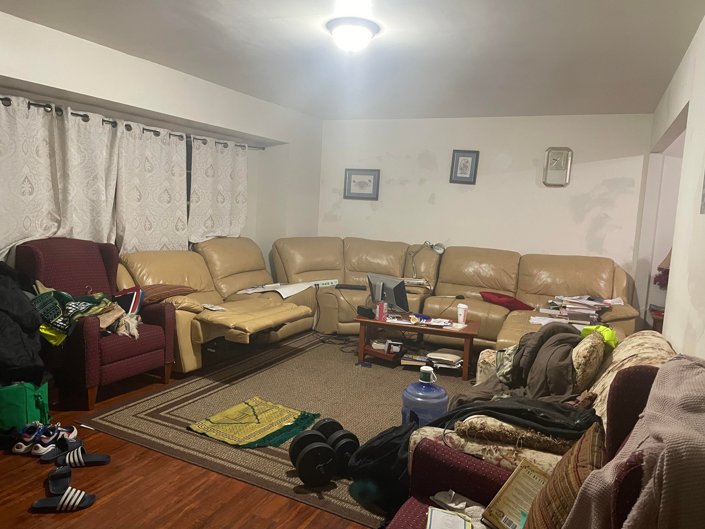
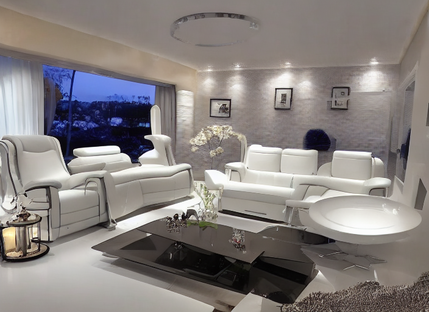

# RoomGPT – AI Room Redesign Application

> A full-stack AI-powered web application developed by **Vu Thanh Trung**.  
> Upload a photo of your room and let AI reimagine it in any interior style — instantly.

---

## 📸 Demo

| Original Room | AI-Generated Room |
|:---:|:---:|
|  |  |

---

## ✨ Overview

**RoomGPT** is a personal project that allows users to upload a photo of their room, choose an interior style and room type, and receive an AI-generated redesigned version of the space — all within seconds.

The application is powered by a ControlNet-based diffusion model via the Replicate API, enabling realistic room transformations while preserving the original room's structure and layout.

---

## 🚀 Key Features

- 📤 **Image Upload** — Drag & drop or browse to upload a room photo (JPEG/PNG)
- 🎨 **Style Selection** — Choose from a variety of interior themes (Modern, Minimalist, Vintage, Industrial, Tropical, Neoclassic, and more)
- 🏠 **Room Type Selection** — Supports Living Room, Bedroom, Bathroom, Office, Gaming Room, and more
- 🤖 **AI Image Generation** — Generates a redesigned room using a state-of-the-art AI model via Replicate API
- ⏳ **Real-time Loading State** — Smooth loading experience while the AI processes the image
- ❌ **Error Handling** — Graceful error messages for failed uploads or API issues
- 🔍 **Before / After Comparison** — Side-by-side slider to compare the original and generated room
- 💾 **Download Result** — Save the AI-generated image directly to your device
- ☁️ **Cloud Deployment** — Deployed and hosted on Vercel for fast, global access

---

## 🛠 Tech Stack

| Layer | Technology |
|---|---|
| **Framework** | Next.js 13 (App Router) |
| **Language** | TypeScript |
| **UI Library** | React 18 |
| **Styling** | Tailwind CSS |
| **AI Model** | Replicate API (ControlNet – HED Boundary) |
| **Image Upload** | Bytescale Upload Widget |
| **Animation** | Framer Motion |
| **Deployment** | Vercel |
| **Rate Limiting** | Upstash Redis *(optional)* |

---

## 📁 Project Structure

```
RoomGPT/
├── app/
│   ├── page.tsx           # Landing page
│   ├── layout.tsx         # Root layout
│   ├── dream/
│   │   └── page.tsx       # Main generate page (upload + result)
│   └── generate/
│       └── route.ts       # Server-side API route (Replicate integration)
├── components/
│   ├── Header.tsx
│   ├── Footer.tsx
│   ├── DropDown.tsx
│   ├── CompareSlider.tsx
│   ├── LoadingDots.tsx
│   ├── ResizablePanel.tsx
│   └── Toggle.tsx
├── utils/
│   ├── dropdownTypes.ts   # Room types & themes
│   ├── redis.ts           # Rate limiter setup
│   ├── appendNewToName.ts
│   └── downloadPhoto.ts
└── public/                # Static assets & demo images
```

---

## ⚙️ How It Works

1. **User uploads** a photo of their room via the Bytescale upload widget
2. The image is **uploaded to Bytescale CDN** and a URL is returned
3. The frontend calls the **`/generate` API route** with the image URL, selected theme, and room type
4. The server sends a **POST request to Replicate API**, starting an AI prediction job using the ControlNet model
5. The server **polls the prediction status** every second until the job succeeds
6. The **generated image URL** is returned and displayed alongside the original for comparison
7. Users can **download** the result or **generate a new design**

---

## 🔐 Environment Variables

Create a `.env` file at the root of the project (see `.example.env` for reference):

```env
# Required
REPLICATE_API_KEY=your_replicate_api_key_here
NEXT_PUBLIC_UPLOAD_API_KEY=your_bytescale_api_key_here

# Optional – for rate limiting
UPSTASH_REDIS_REST_URL=
UPSTASH_REDIS_REST_TOKEN=
```

| Variable | Description |
|---|---|
| `REPLICATE_API_KEY` | API key from [replicate.com](https://replicate.com) |
| `NEXT_PUBLIC_UPLOAD_API_KEY` | API key from [bytescale.com](https://www.bytescale.com) |
| `UPSTASH_REDIS_REST_URL` | *(Optional)* Redis URL for rate limiting |
| `UPSTASH_REDIS_REST_TOKEN` | *(Optional)* Redis token for rate limiting |

---

## 👤 Author

**Vu Thanh Trung**  
Full-stack Developer  

- GitHub: [@trungvu222](https://github.com/trungvu222)

---

## 📄 License

This project is **proprietary software** developed by Vu Thanh Trung.  
All rights reserved. Not open source. Do not copy, distribute, or reuse without permission.
